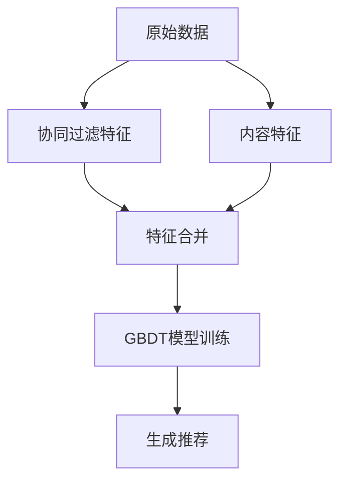

# Movie_Recommend_System

## 📌 项目概述
这是一个基于协同过滤 (Collaborative Filtering) 和内容过滤 (Content-Based Filtering) 的使用机器学习算法的混合电影推荐系统，使用 Python 和 scikit-learn 实现。

## 🛠️ 技术栈
- **语言**: Python 3
- **核心库**: 
  - pandas/numpy (数据处理)
  - scikit-learn (机器学习模型)
  - scipy (稀疏矩阵处理)

## 📂 文件结构
```
/movie-recommender
│── 电影推荐(machine_learning).py.py       # 主推荐系统代码
│── data/                # 数据集目录（需自行添加）
│   ├── movies.xlsx      # 电影元数据
│   └── ratings.xlsx     # 用户评分数据
│── README.md            # 项目说明文档

```

## 🔧 安装与运行

### 1. 环境配置
pychram


### 2. 数据准备
将以下文件放入 `data/` 目录：
- `movies.xlsx` - 包含电影信息（MOVIE_ID, NAME, GENRES 等字段）
- `ratings.xlsx` - 包含用户评分（USER_MD5, MOVIE_ID, RATING 等字段）

### 3. 运行推荐系统
```python
python 电影推荐(machine_learning).py
```

## 🧠 算法架构

### 混合推荐流程


### 关键技术
1. **特征工程**：
   - 协同过滤：使用 TruncatedSVD 分解用户-物品矩阵
   - 内容过滤：TF-IDF 处理电影类型文本

2. **模型训练**：
   - Gradient Boosting Decision Tree (GBDT) 回归
   - 预测用户对未观看电影的评分

## 💡 核心类说明

### `HybridRecommender` 类

#### 主要方法：
| 方法 | 描述 |
|------|------|
| `load_data()` | 加载并预处理数据 |
| `_extract_cf_features()` | 提取协同过滤特征 |
| `_extract_cb_features()` | 提取内容特征 |
| `train_model()` | 训练推荐模型 |
| `recommend()` | 为用户生成推荐 |

#### 使用示例：
```python
recommender = HybridRecommender()
recommender.load_data("data/豆瓣数据")  # 修改为你的数据路径
recommender.train_model()

# 为用户生成推荐
recs = recommender.recommend("47e69de0d68e6a4db159bc29301caece", top_n=5)
print(recs[['NAME', 'GENRES', 'PRED_RATING']])
```

## 📊 性能指标
- 使用 RMSE (Root Mean Square Error) 评估模型
- 典型表现：RMSE ≈ 0.8-1.2（取决于数据质量）

## 🚀 后续改进方向
1. 增加深度学习模型（如 NeuralCF）
2. 加入实时用户行为反馈
3. 优化冷启动问题处理


---
